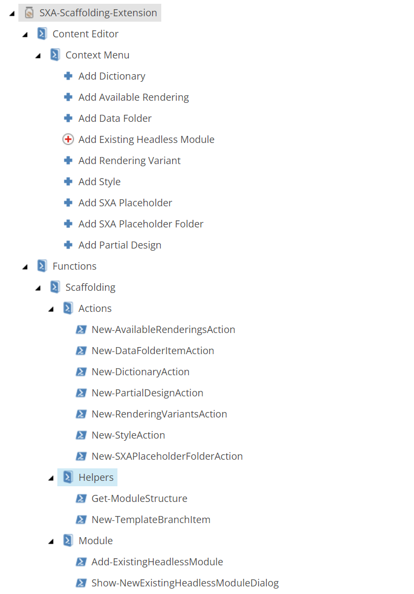
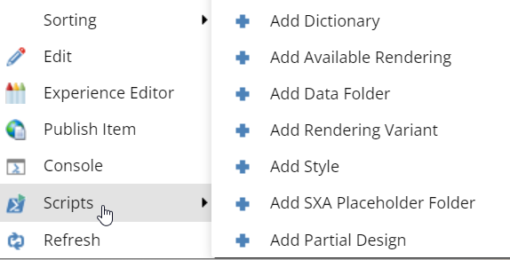

# SXA-Headless-Scaffolding-Extension

This extension is a powershell module which provide an easy way to create sxa headless module and speed up the process.

Detailed explanation: https://www.ashournia.com/sxa-headless-scaffolding-extension/

## Script Module:

## Available Actions:
